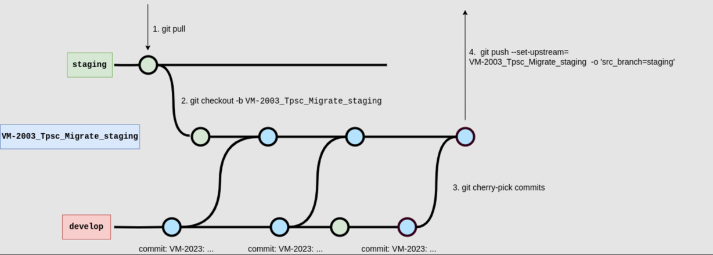
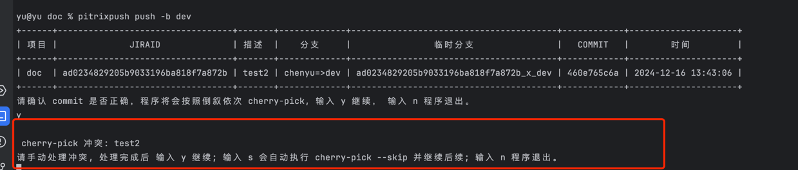
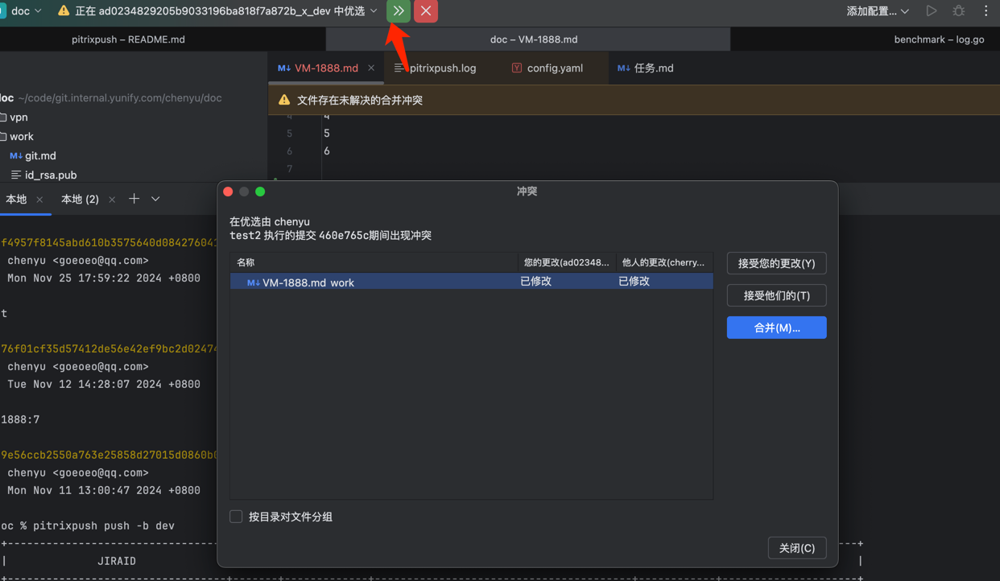
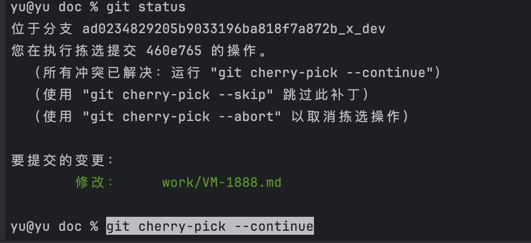
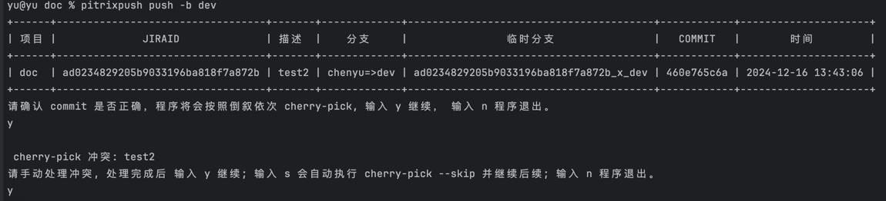

# 介绍
一个通过cherry-pick 合代码的工具，每周可以帮你节约出半个小时

假设我的开发分支为develop，要将commit合入staging的过程如下：
1. 检出最新dev
2. 从dev checkout 出一个临时分支
3. 通过cherry-pick 将 develop分支中的commit 合进临时分支
4. 推送临时分支到远程
5. 创建临时分支到dev的mr
6. 合并mr
7. 删除本地以及远程的临时分支

如果某个JIRA 需要修复v6.0,v6.1,v6.2,且这个JIRA 需要修改三个项目,A,B,C,那以上7步操作你需要执行 
(dev,qa,staging,v6.0,v6.1,v6.2) * (A,B,C)=6x3=18次    
假设不用处理冲突，执行一次2分钟，18x2=36分钟 合一个JIRA就需要半个小时。


## 功能介绍

| 命令   | 作用                   |
|------|----------------------|
| push | cherry-pick方式推送合并代码  |
| hook   | 通过Hook可以触发jenkins刷代码 |
|  info    | 打印当前项目url            |
|   jira   | 打印提交信息               |


## push 实现原理
核心思想： **以一个 jira 为一次提交 patch 的中心点.**
以如下场景为例：
develop 分支: VM-2003_Tpsc_Migrate_develop，代码修改都在这个分支上，现在要合并到 staging 分支上。


1. 先 pull 最新的 staging 分支
2. 基于最新的 staging 分支创建新分支 VM-2003_Tpsc_Migrate_staging。
3. 将 develop 分支中的修改，依次 cherry-pick 到 VM-2003_Tpsc_Migrate_staging中(程序中：会通过 jiraId 匹配 commit message 的开头筛选出此次需要合并的变更。)
4. 将 VM-2003_Tpsc_Migrate_staging push 到 remote。
5. 自动调用gitlab 创建mr (如果配置)
6. 自动合并mr (如果配置)


# 安装
1. 下载执行程序  
   通过go下载
   ```
   go install  github.com/goeoeo/gitx@latest
   ```

   直接下载执行程序https://github.com/goeoeo/gitx/releases/download/v0.0.1/gitx_Darwin_arm64
   ```
   sudo wget -O /usr/local/bin/gitx "https://github.com/goeoeo/gitx/releases/download/v0.0.1/gitx_$(uname -s)_$(uname -m)"  && sudo chmod +x /usr/local/bin/gitx
   ```
   注意：mac下遇到无法打开gitx的错误,需要到到设置->隐私与安全中 授权一下   

2. 初始化配置文件  
   gitx init
3. 编辑配置 (也可以使用vim)   
   vim $PWD/.patch/config.yaml  

# 使用
进入当前项目目录，并切换到开发分支。  

| 功能 | 命令                  | 说明                                 |
|----|---------------------|------------------------------------|
| 推送 | gitx push -b dev,qa | 推送commitID 支持多项项目，指定jira或commit 推送 |
| 打印 | gitx jira -a print  | 打印你计划要推送的jira信息                    |
| 删除 | gitx jira -a clear  | 删除临时分支                             |
 

## 推送带JIRA信息的commit 
将当前分支中的 commit 推送到 dev,qa分支  

默认情况下 会自动从最近一次的commit中检索jiraID  
```
yu@yu doc % gitx push -b dev,qa
```

当前推送的JIRAID 不在最后一次commit中,使用 -j参数指定
```
yu@yu doc % gitx push -b dev,qa -j VM-8888
```

> 使用-p参数推送多个项目： -p common,ws,fg

> 使用-t参数指定计划推送的分支 -t dev,qa,staging

## 推送不携带JIRA信息的commit
在某些情况下commit并没有JIRA信息，比如打包，编译，配置，ci，代码格式等变动，一般没有jiraID  
将当前分支中的 commit 推送到 dev,qa分支  
和携带JIRA信息的commit命令一致，但此时会将整个commit的msg，作为检索commit的依据  
此场景下，你的commit msg应当详细

commit是最近一次的情况：
```
yu@yu doc % gitx push -b dev,qa
```

从历史记录里面选commit，-j参数传commitID，其会帮忙挑选具有相同msg的作为commit组

```
yu@yu doc % gitx push -b dev,qa -j a67f4bae1
```


## 自动清理临时分支
清理临时分支时会判定目标分支是否已经合入，只有合入后的临时分支才会清理
```
gitx jira -a=clear
```
可以结合定时任务清理，保持本地分支以及远程分支的简洁性。  
配置 每天17点5分清理临时分支   
crontab -e
```
5 17 * * * /usr/local/bin/gitx jira -a=clear
```

## 处理冲突
有冲突时会出现如下提示


处理冲突：
1. 使用ide处理冲突    
       
2. 新开一个终端执行命令：git cherry-pick --continue    
      
3. 回到gitx所在终端，输入y继续   
      


## 更多操作
```
gitx -h
```


如果这个项目有帮助到你，帮忙点个star😊