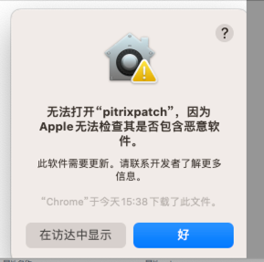

# 介绍
一个通过cherry-pick 合代码的工具，每周可以帮你节约出半个小时


假设我的开发分支为chenyu，要将commit合入dev的过程如下：
1. 检出最新dev
2. 从dev checkout 出一个临时分支
3. 通过cherry-pick 将 chenyu分支中的commit 合进临时分支
4. 推送临时分支到远程
5. 创建临时分支到dev的mr
6. 合并mr
7. 删除本地以及远程的临时分支

如果某个JIRA 需要修复v6.0,v6.1,v6.2,且这个JIRA 需要修改三个项目,pitrix-common,pitrix-ws,pitrix-fg,那以上7步操作你需要执行 
(dev,qa,staging,v6.0,v6.1,v6.2) * (pitrix-common,pitrix-ws,pitrix-fg)=6x3=18次    
假设不用处理冲突，执行一次2分钟，18x2=36分钟 合一个JIRA就需要半个小时。

## 对比的patch-push，做了哪些优化
另外一个项目：https://git.yunify.com/zhengyangliu/patch-push   

这里将涵盖JIRAID,和不包含JIRAID的commit统一称为 commit组，一个commit组里面包含多个commit
1. 支持从项目目录，执行命令，会自动推断JIRA，无须再手动填JIRA
2. 简化了配置，支持JIRA，命令行传参，不需要再修改config.yaml
3. 支持无JIRAID commit组推送
4. commit组推送是幂等性的，例如commit组里面包含三个commit,A,B,C,如果你的目标分支里面已经包含了A,B 重复执行推送只会推送C,不会再推送A,B（之前的工具会推送AB,或者需要人工判定是否需要推送AB,这样大概率会冲突）
5. 支持本地分支以及远程分支的清理（清理命令会判定commit是否以及合入目标分支），配合定时任务使用后，无须再手动处理
6. 所有的pitrixpush操作完成后，都会保持你开始进行推送的分支，不会乱切。
7. 当有冲突时会自动删除你本地的目标分支，重新拉取远程的分支进行cherry-pick，无须手动处理
8. 自动创建mr(可配)
9. 自动合并mr(可配)
10. 优化了打印信息


# 安装
1. 下载执行程序  
   通过go下载
   ```
   GOPRIVATE="git.yunify.com" go install  github.com/goeoeo/gitx@latest
   ```

   直接下载执行程序
   ```
   sudo wget -O /usr/local/bin/pitrixpush "https://github.com/goeoeo/gitx/-/raw/main/bin/pitrixpush_$(uname -s)_$(uname -m)?inline=false"  && sudo chmod +x /usr/local/bin/pitrixpush
   ```
   mac下遇到以下错误,到设置->隐私与安全中 授权一下   
   

2. 初始化配置文件  
   pitrixpush init
3. 编辑配置 (也可以使用vim)   
   pycharm $PWD/.patch/config.yaml  

# 使用
进入当前项目目录，并切换到开发分支。  

| 功能 | 命令                        | 说明                                 |
|----|---------------------------|------------------------------------|
| 推送 | pitrixpush push -b dev,qa | 推送commitID 支持多项项目，指定jira或commit 推送 |
| 打印 | pitrixpush jira -a print  | 打印你计划要推送的jira信息                    |
| 删除 | pitrixpush jira -a clear  | 删除临时分支                             |
 

## 推送带JIRA信息的commit 
将当前分支中的 commit 推送到 dev,qa分支  

默认情况下 会自动从最近一次的commit中检索jiraID  
```
yu@yu doc % pitrixpush push -b dev,qa
```

当前推送的JIRAID 不在最后一次commit中,使用 -j参数指定
```
yu@yu doc % pitrixpush push -b dev,qa -j VM-8888
```

> 使用-p参数推送多个项目： -p common,ws,fg

> 使用-t参数指定计划推送的分支 -t dev,qa,staging

## 推送不携带JIRA信息的commit
在某些情况下commit并没有JIRA信息，比如打包，编译，配置，ci，代码格式等变动，一般没有jiraID  
将当前分支中的 commit 推送到 dev,qa分支  
和携带JIRA信息的commit命令一致，但此时会将整个commit的msg，作为检索commit的依据  
此场景下，你的commit msg应当详细

commit是最近一次的情况：
```
yu@yu doc % pitrixpush push -b dev,qa
```

从历史记录里面选commit，-j参数传commitID，其会帮忙挑选具有相同msg的作为commit组

```
yu@yu doc % pitrixpush push -b dev,qa -j a67f4bae1
```


## 自动清理临时分支
清理临时分支时会判定目标分支是否已经合入，只有合入后的临时分支才会清理
```
pitrixpush jira -a=clear
```
可以结合定时任务清理，保持本地分支以及远程分支的简洁性。  
配置 每天17点5分清理临时分支   
crontab -e
```
5 17 * * * /usr/local/bin/pitrixpush jira -a=clear
```

## 处理冲突
有冲突时会出现如下提示


处理冲突：
1. 使用ide处理冲突    
       
2. 新开一个终端执行命令：git cherry-pick --continue    
      
3. 回到pitrixpush所在终端，输入y继续   
      


## 更多操作
```
pitrixpush -h
```


如果这个项目有帮助到你，帮忙点个star😊